# SGI 2023/2024

## Group T08G01
| Name             | Number    | E-Mail             |
| ---------------- | --------- | ------------------ |
| Henrique Silva         | 202007242 | up202007242@up.pt                |
| Tiago Branquinho         | 202005567 | up202005567@up.pt                |

----

## Projects

### [TP1 - ThreeJS Basics](tp1)

 - This project represents a room with a table, a window and some decoration.
 - Since it is someone's birthday, there are balloons, and most importantly a birthday cake.
 - The illumination consists on a light at the top, the candle's flame and the sunset light coming from the window.
 - Every object on the scene receives and casts shadows.
 - There is a happy birthday mode in the interface, which turns the lights off. Initially this also controlled the existance of the candle's flame (and consequently its light), which would enrich the project in our opinion. However, since the candle and its light were a main requirement following our approach, we decided to remove that feature.
 - As the strong points of this project, we can inumerate the balloons, which demonstrate creativity, the flower and its jar, and the reality effect achieved from the light coming form the window, as well as from all the shadows developed.

 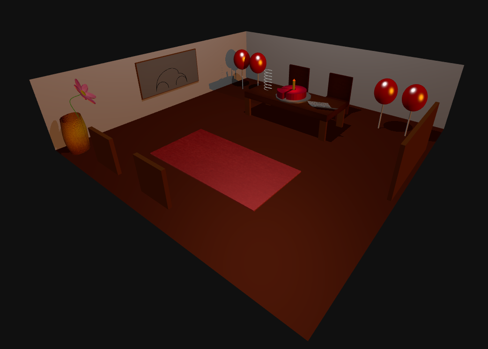
 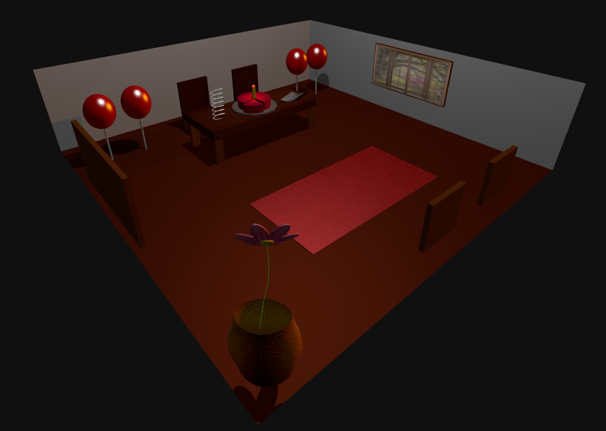
 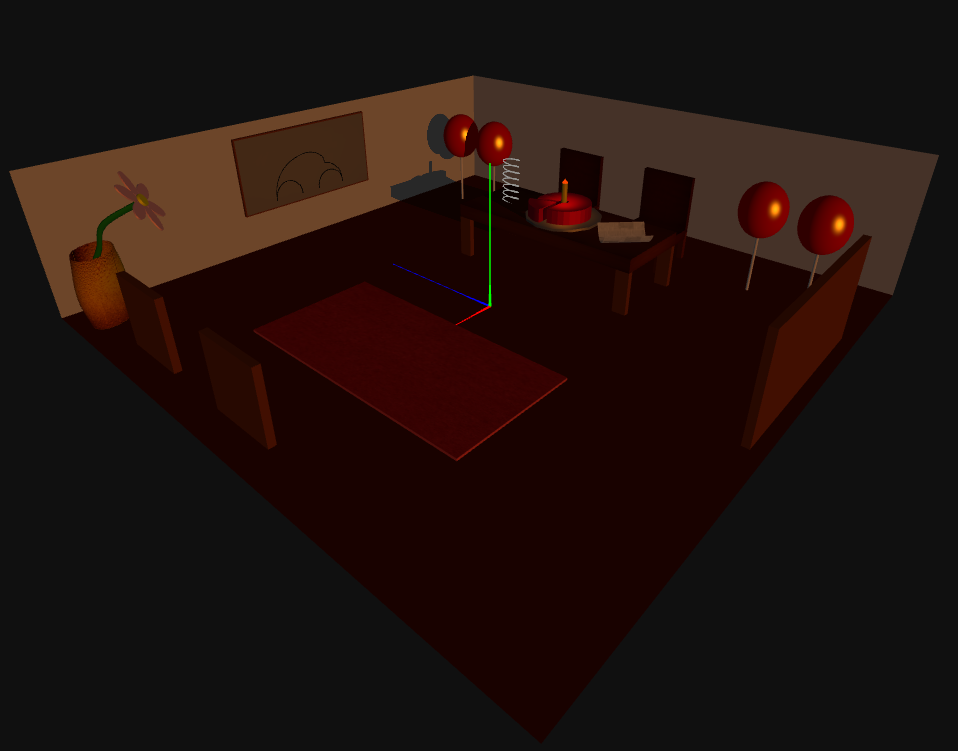

-----

### [TP2](tp2)
 
#### Scene Graph

The parsing approach can be seen as a mix between top-down and bottom-up processing. It starts by interpreting the XML file's structure from the root level, examining global settings, textures, materials, cameras, nodes, and lights. Then, when specific elements like textures, materials, or geometries for objects in the scene are encountered, it processes these elements individually, creating specific objects based on the data available. 
The 3D scene is constructed by generating objects, applying materials, setting positions, and other attributes based on the parsed specifications in the XML file.

#### Detail Level

LODs, which allow to have multiple degrees of detail, are supported in the parser and implemented in the created XML scene.

#### Advanced Textures

The parser support all types of required textures, that is: sky boxes, mip-maps, bump-textures, video-textures. All of these are implemented in the XML scene.

#### Visualization in Wireframe

Wireframe materials are supported by the parser and is implemented in the XML in the line supporting the disco ball.

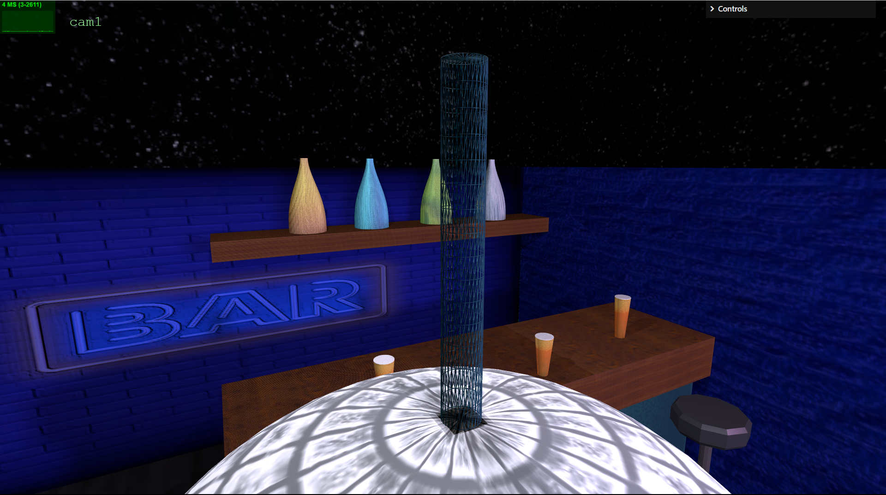

#### Buffer Geometry

Buffer geometry is supported by the parser allowing the construction of polygons and is implemented in the XML scene in the "No Smoking" sign.

#### GUI

A GUI that allows to move and modify cameras, lights and different depth nodes was implemented.

#### XML Scene

The XML scene showcases a night bar, constructed by a wood floor and four brick walls with bump textures, one of them containing a neon sign emitting light. The bar is also lightened by two pointlights and two spotlights. Inside there can be seen two benches, a table, a counter and a shelf with wood textures, as well as four bottles constructed with nurbs, a disco ball with a video texture, a dart target with bump textures and mip-maps, three pints with video textures and bump textured foam, three stools, constructed using a 3D model, and a "No Smoking" sign, constructed using buffer geometry to design the polygon that constitures the background of the sign. The bar is encapsulated by a sky box with a starry night and, when zooming out, objects with nurbs will be replaced with less detailed primitives, while objects of smaller dimensions will gradually disappear.   

 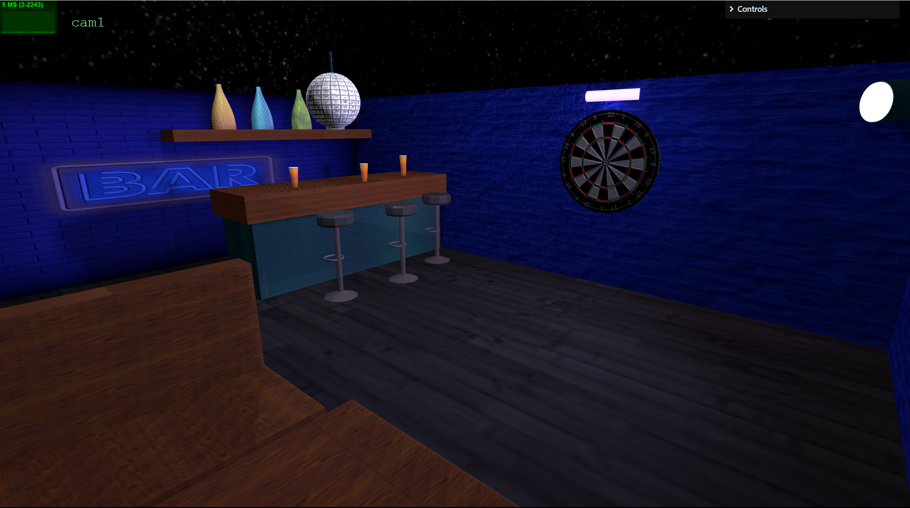
 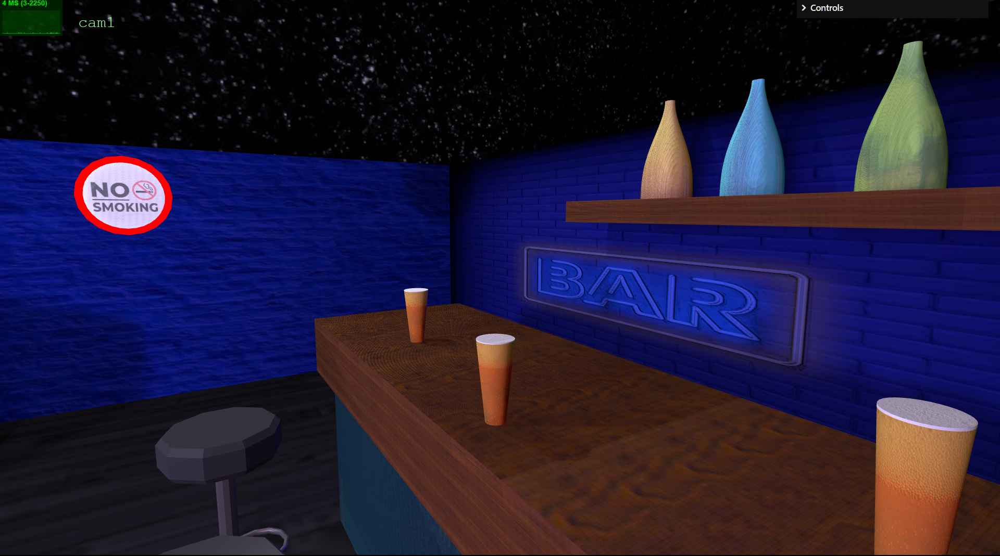
 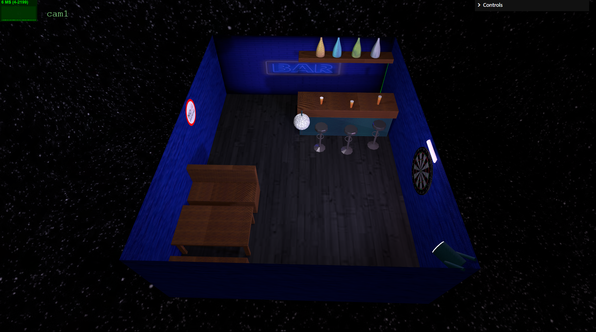
 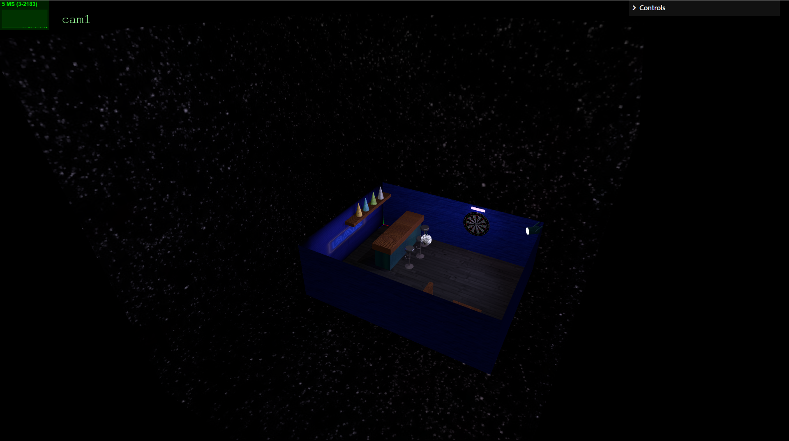

----

### [TP3](tp3)

#### Menus

Main and end game menus were developed. The first one enables race configuration, regarding player and bot cars, bot difficulty, laps and player name, while the second enables the ability to restart the race or to return to the main menu. Both of these are controllable via the implemented picking mechanism and display information using 3D text.

#### Car

Both available cars are very realistic model 3D objects.

##### Animation

Bot movement was made using keyframe animation. It's orientation along the track was calculated knowing the next point of it's route.
The different dificulties of the bot were distinguished by the duration of the animation. The shorter animation duration, the faster the bot moves through the track.

##### Control

The player controls features acceleration, braking, and automatic deceleration. Reverse gear and a turning capability based on the current velocity (with a cap) was also implemented. All of this took into consideration the deltas influenced by the frame rates, so that the car control runs evenly on different fps values. Wheel forward (or backward) rotation was also implemented based on the velocity of the car, as well as side rotation, when the wheels turn. In order to acheive further realism, the car's turning circle was changed to the centre of the real axel.

##### Colision detection

These detections are constantly being made. The mechanism that detects whether the car or another object is on track is implemented using raycasters, and the rest is made with computations regarding object positions.

The implemented checkpoint system also follows the same process. If one of the checkpoints is missed, or the order of reaching the checkpoints is incorrect the lap won't count, forcing the player to redo the lap and, thus, preventing cut ways.

#### Picking

This technique was used on the main and end game menus, as well as on the game itself. It is very versatile, handling model 3d and mesh objects. Also includes color variations, to illustrate the user the picked elements. Obstacles and cars inside the specific parking lots can be selected.

#### Spritesheets

The informations in the outdoor display (screens) were written using spritesheets: the coordinates on the font texture are calculated through the ASCII code of a caracter. Those informations include the current and the total laps to be done, the player velocity, maximum velocity and current time. Also, any effect that the player is suffering from, due to a colision, is displayed, next to the time remaining for it to end.

#### Particle System

A particle system was applied to create fireworks after the race ends. All fireworks are launched from the same position in random, slighly different, directions. When the particle reachs the end of it's life, it explodes, generating more particles that make for a growing sphere that moves slightly acrosse the sky until it disappears. 

#### Detail Level

Shaders were applied to both obstacles and power-ups. Cones (obstacles) across the track have a pulsating appearence, modifying both they color and appearence through time, while speed ramps (power-ups) have a visual appearence of continuous movenment. 

The information outdoor also includes a shader material on it's screen, adding slight bumps according to it's checkered appearence. 

# Prints

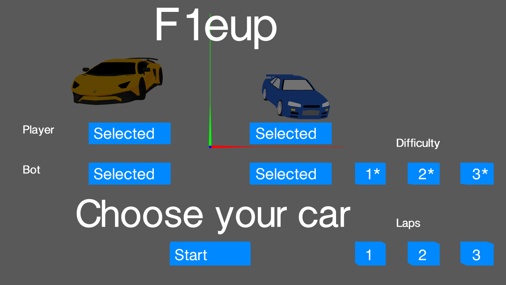
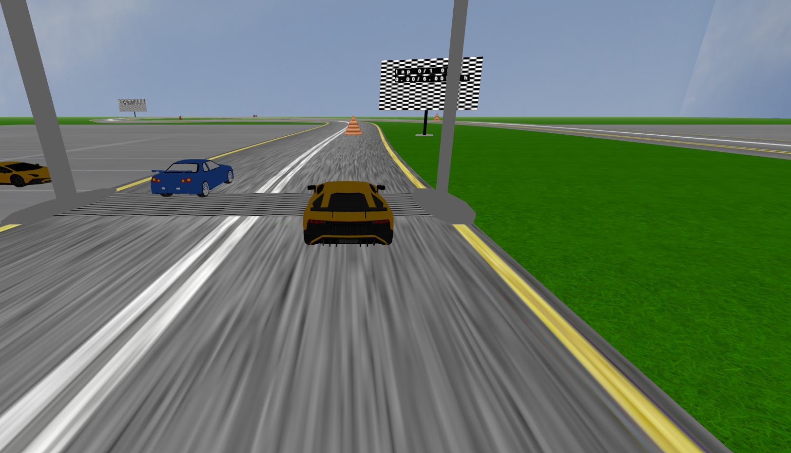
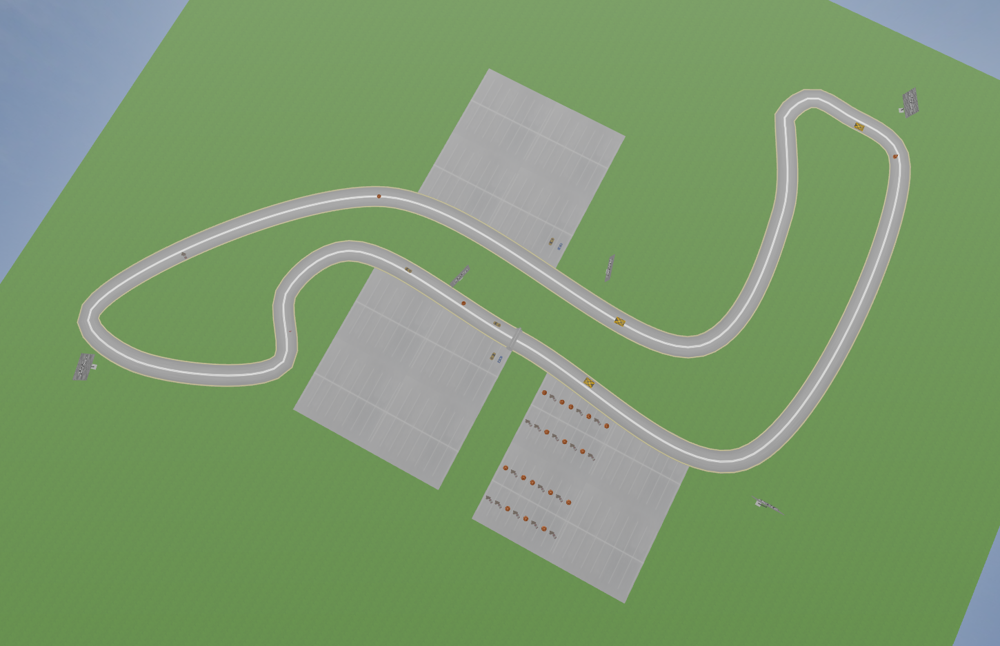
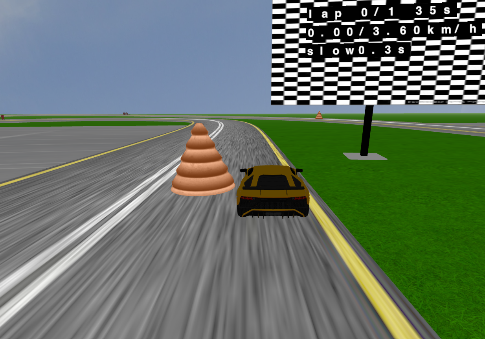
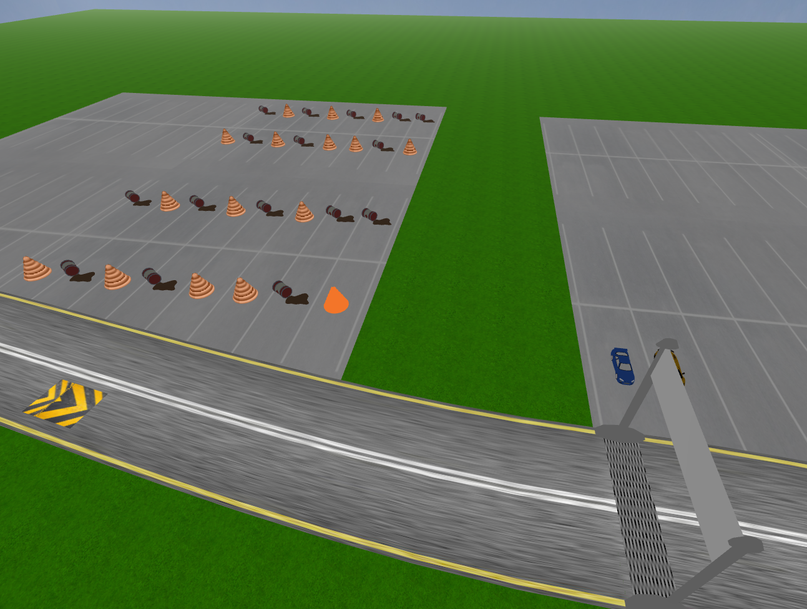
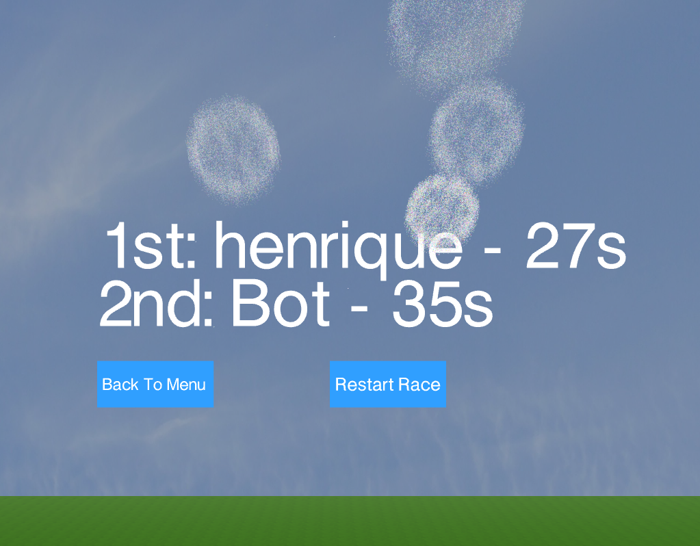

