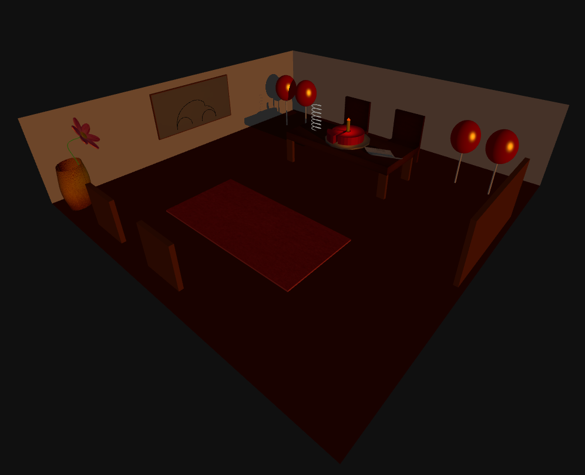

# SGI 2023/2024

## Group T0xG0y
| Name             | Number    | E-Mail             |
| ---------------- | --------- | ------------------ |
| John Doe         | 201901010 | ...                |
| Jane Doe         | 201901011 | ...                |

----

## Projects

### [TP1 - ThreeJS Basics](tp1)

 - This project represents a room with a table, a window and some decoration.
 - Since it is someone's birthday, there are balloons, and most importantly a birthday cake.
 - The illumination consists on a light at the top, the candle's flame and the sunset light coming from the window.
 - Every object on the scene receives and casts shadows.
 - There is a happy birthday mode in the interface, which turns the lights off. Initially this also controlled the existance of the candle's flame (and consequently its light), which would enrich the project in our opinion. However, since the candle and its light were a main requirement following our approach, we decided to remove that feature.
 - As the strong points of this project, we can inumerate the balloons, which demonstrate creativity, the flower and its jar, and the reality effect achieved from the light coming form the window, as well as from all the shadows developed.

 
 
 

-----

### [TP2 - ...](tp2)
- (items briefly describing main strong points)

----

### [TP3 - ...](tp3)
- (items briefly describing main strong points)

